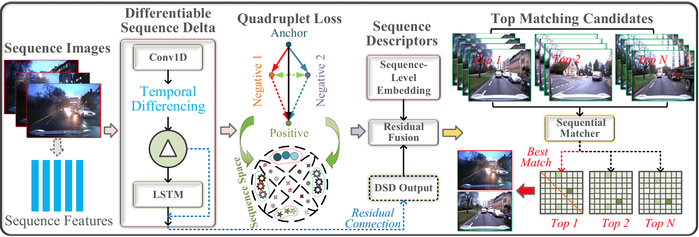
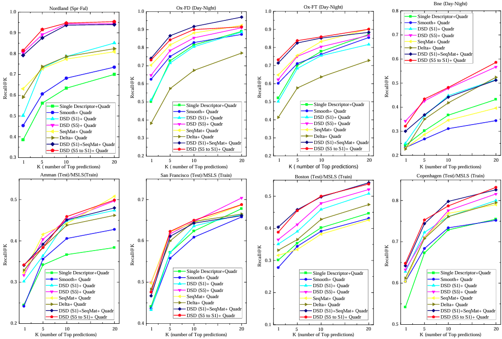

<p align="center">
<h1 align="center">OptiCorNet: Optimizing Sequence-Based Context Correlation for Visual Place Recognition</h1>
 <p align="center">

###  Introduction

This paper presents OptiCorNet, a novel sequence modeling framework that unifies spatial feature extraction and temporal differencing into a differentiable, end-to-end trainable module. Central to our approach is a lightweight 1D convolutional encoder combined with a learnable differential temporal operator, termed Differentiable Sequence Delta (DSD), which jointly captures short-term spatial context and long-range temporal transitions. The DSD module models directional differences across sequences via a fixed-weight differencing kernel, followed by an LSTM-based refinement and optional residual projection, yielding compact, discriminative descriptors robust to viewpoint and appearance shifts. To further enhance inter-class separability, we incorporate a quadruplet loss that optimizes both positive alignment and multi-negative divergence within each batch. Unlike prior VPR methods that treat temporal aggregation as post-processing, OptiCorNet learns sequence-level embeddings directly, enabling more effective end-to-end place recognition.

###  Structure overview




### Experimental results




## Setup
### Conda
```bash
conda create -n seqnet numpy pytorch=1.8.0 torchvision tqdm scikit-learn faiss tensorboardx h5py -c pytorch -c conda-forge
```

## Run

### Train
To train sequential descriptors through dsdnet on the Nordland dataset:
```python
python main.py --mode train --pooling dsdnet --dataset nordland-sw --seqL 10 --w 5 --outDims 8192 --expName "w5"
```
or the Oxford dataset (set `--dataset oxford-pnv` for pointnetvlad-like data split:
```python
python main.py --mode train --pooling dsdnet --dataset oxford-v1.0 --seqL 5 --w 3 --outDims 8192 --expName "w3"
```
or the MSLS dataset (specifying `--msls_trainCity` and `--msls_valCity` as default values):
```python
python main.py --mode train --pooling dsdnet --dataset msls --msls_trainCity melbourne --msls_valCity austin --seqL 5 --w 3 --outDims 8192 --expName "msls_w3"
```

To train transformed single descriptors through dsdnet:
```python
python main.py --mode train --pooling dsdnet --dataset nordland-sw --seqL 1 --w 1 --outDims 8192 --expName "w1"
```

### Test
On the Nordland dataset:
```python
python main.py --mode test --pooling dsdnet --dataset nordland-sf --seqL 5 --split test --resume ./data/runs/Jun03_15-22-44_l10_w5/ 
```
On the MSLS dataset (can change `--msls_valCity` to `melbourne` or `austin` too):
```python
python main.py --mode test --pooling dsdnet --dataset msls --msls_valCity amman --seqL 5 --split test --resume ./data/runs/<modelName>/
```
  
## Acknowledgement
The code in this repository is based on [seqNet](https://github.com/oravus/seqNet). Thanks to for his contributions to this code during the development of our project [OptiCorNet](https://github.com/CV4RA/OptiCorNet.git).
